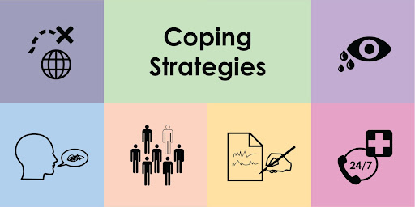

What are healthy coping mechanisms? Healthy coping mechanisms are ways to deal with the issues that might affect our mental health. There are many different coping mechanisms and the coping mechanism that works best is different for everyone.

Some examples of coping skills are:
- Boundaries:
  - Setting hours for yourself
    - The ability to spend time for yourself, relax, and focus on your needs
    - Helps you focus on your mental health and benefits things such as promoting better self-esteem and self-confidence
    - Spend some time off your phone and cut off communication for at least 30 minutes a day maybe like read a book, meditate or do some journaling
  - Being direct and clear of your needs
    - Direct and clear communication benefits you when earning respect
    - Being more social and not make your life based on social media
    - Put your health before anything and have your priorities straight
  - Setting boundaries for other people
    - Important to set boundaries so you can feel comfortable and respected, this also helps you avoid “burnout”
    - Setting boundaries gives you the ability to develop a greater self-esteem, meaning that you gain more confidence
    - Setting boundaries benefits you when developing independence because you have more control over the things you do and disregarding others which benefit you when focusing on yourself
- Consistency:
  - Helps you set guidelines and expectations for yourself
  - Have a routine to follow (Helps with future plans and stress overload)
  - Benefits you because people with mental health illnesses have the ability to know what to expect than being overwhelmed, this is to make it easier for them to face upcoming challenges
- Support Groups:
  - Talk about common experiences
  - Provides a sense of community and empathetic understanding
  - The feeling of loneliness, isolation, and being judged is reduced to the point where they have a sense of belonging
  - Improves the ability to cope with challenges
  - Reduced distress, depression, anxiety, and fatigue
  - Helps you open up
- Therapy:
  - Helps you manage and face your problems with outside help and a new perspective
  - Different kinds of therapy:
    - Behavioral therapy: focus on changing how you act.
    - Cognitive behavioral therapy: change how you think about something
    - Dialectical behavioral therapy: helps to process emotions, through talking
- Surrounding yourself with people you love
  - Helps you feel better about yourself overall
  - Avoid unhealthy friendships and relationships
  - Decreases stress levels
  - Helps you focus on your end goals

## **Toxic coping mechanisms: What are toxic or unhealthy coping mechanisms and what do they look like?**

Toxic coping mechanisms are ways in which we cope that aren't healthy for us. They are ways that people cope that are harmful and may make the problems we have worse.

Toxic copings are things like:

- Drug usage
  - Any harmful substance that is consumed
  - Can lead to addiction, which can be a lifelong problem
- Avoidance
  - When we are in situations it is possible to avoid things that you find enjoyable, avoid the people you love, and go around the problem and not address it
  - Examples: procrastinating, drug use, isolation, overspending
- Self Harm
  - Hurting yourself
  - Many different ways but some common ones are unhealthy eating habits, getting into fights, and physically harm
- Self Sabotage
  - Getting or letting yourself stay in situations that are not healthy and beneficial for you
  - Some ways people self-sabotage are dismissing feelings, critisizing themselves, people pleasing, and comparing themselves to others
- Toxic positivity
  - Believing that no matter how bad something is you should always be positive
  - Doesn’t allow you to experience all your emotions
